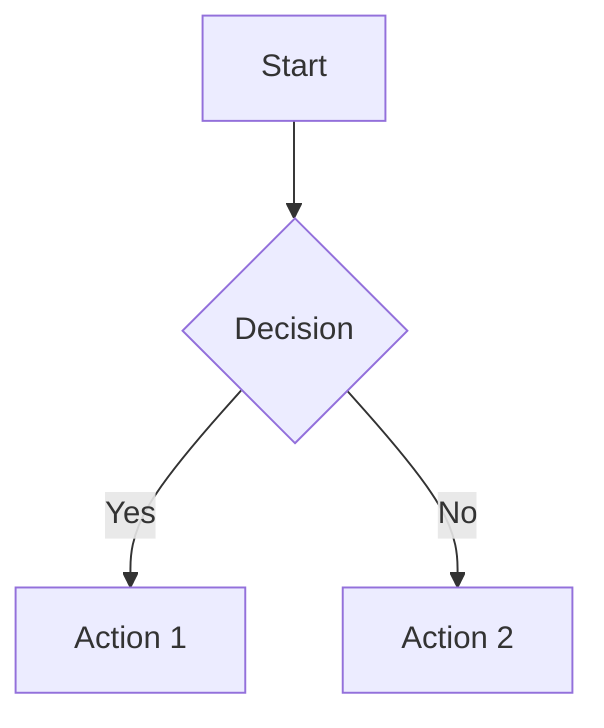

## Markdown Extensions

Mizuki extends standard Markdown with several powerful features through custom remark/rehype plugins.

### Admonition Blocks

Use admonition blocks to highlight important information:

```markdown
:::note
This is a note.
:::

:::tip
This is a tip.
:::

:::warning
This is a warning.
:::

:::caution
This is a caution.
:::

:::important
This is important.
:::
```

### GitHub Embeds

Embed GitHub repositories directly:

```markdown
:::github{repo="owner/repo"}
:::
```

### Mermaid Diagrams

Create diagrams using Mermaid syntax:

````markdown

````

### Code Blocks

Code blocks support syntax highlighting with Expressive Code:

```javascript title="example.js"
const greeting = "Hello, World!";
console.log(greeting);
```

Features include:
- Line numbers
- Title annotations
- Line highlighting
- Copy button
- Language badge

### File Tree

Display directory structures:

```markdown
:::file-tree
- src
  - components
  - pages
  - content
:::
```

### Steps

Create step-by-step instructions:

```markdown
:::steps
1. First step
2. Second step
3. Third step
:::
```
