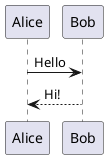

# PlantUML 图表配置

Mizuki 支持在 Markdown 文章中使用 PlantUML 语法绘制 UML 图表。PlantUML 代码块在构建时会被编码并发送到 PlantUML 服务器渲染为 SVG 图片，页面端根据亮暗主题自动切换图源，并支持缩放、拖拽和全屏交互。

## 基本配置

配置文件位于 `src/config/plantumlConfig.ts`：

```typescript title="src/config/plantumlConfig.ts"
import type { PlantUMLConfig } from "../types/config";

export const plantumlConfig: PlantUMLConfig = {
  enable: true,
  server: "https://www.plantuml.com/plantuml",
  lightTheme: "",
  darkTheme: "",
};
```

## 配置项说明

| 字段 | 类型 | 默认值 | 说明 |
|------|------|--------|------|
| `enable` | `boolean` | `true` | 是否启用 PlantUML 渲染；关闭时 `plantuml` 代码块退化为普通代码高亮 |
| `server` | `string` | `"https://www.plantuml.com/plantuml"` | PlantUML 服务器地址，尾部斜杠会自动归一化；默认使用官方公共服务器 |
| `lightTheme` | `string` | `""` | 亮色模式下注入的 PlantUML 主题名，空字符串表示不注入 |
| `darkTheme` | `string` | `""` | 暗色模式下注入的 PlantUML 主题名，空字符串表示不注入 |

## 使用方法

在 Markdown 文章中使用 ` ```plantuml ` 代码块（语言标识必须为小写 `plantuml`）：

````markdown

````

示例：


## 交互功能

渲染后的 PlantUML 图表支持以下交互：

- **缩放**：鼠标滚轮缩放，或使用右上角 +/- 按钮
- **拖拽**：缩放后可拖拽移动图表
- **全屏**：点击全屏按钮进入全屏查看模式
- **主题切换**：根据页面亮/暗主题自动切换对应图源

## 主题配置

PlantUML 支持多种内置主题，通过 `lightTheme` 和 `darkTheme` 配置可以分别设置亮色和暗色模式下的渲染主题：

```typescript title="src/config/plantumlConfig.ts"
export const plantumlConfig: PlantUMLConfig = {
  enable: true,
  server: "https://www.plantuml.com/plantuml",
  lightTheme: "plain",
  darkTheme: "cerulean",
};
```

常用主题包括：`plain`、`outline`、`cerulean`、`sketchy`、`toy` 等。完整主题列表请参考 [PlantUML 官方文档](https://plantuml.com/theme)。

## 自建服务器

如果不想使用官方公共服务器（可能有速率限制），可以自建 PlantUML 服务器：

1. 使用 Docker 部署：`docker run -d -p 8080:8080 plantuml/plantuml-server`
2. 将 `server` 配置修改为自建地址：`"http://localhost:8080/plantuml"`

::: warning 注意
PlantUML 渲染依赖外部服务器，构建时需要能访问配置的服务器地址。使用官方服务器时，复杂图表可能会因超时而渲染失败。
:::